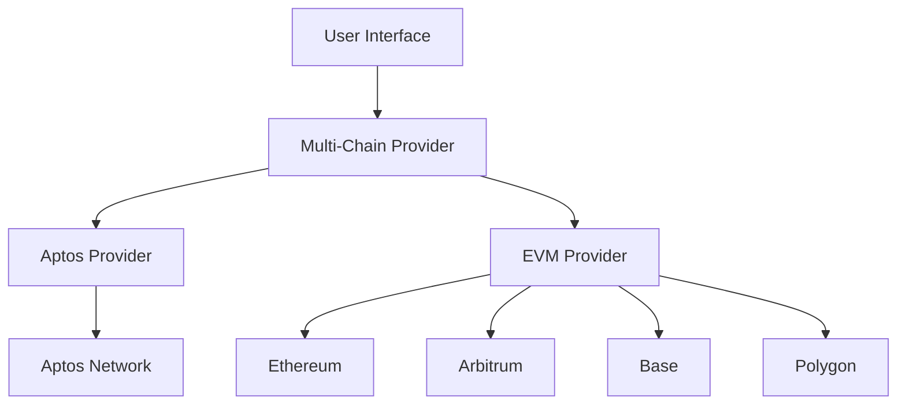

# 🏗️ System Architecture

This document outlines the architecture of EarnestPay's multi-chain implementation, focusing on how different components interact to provide seamless cross-chain functionality.

## High-Level Architecture



## Core Components

### 1. Multi-Chain Provider

The `MultiChainProvider` component serves as the main entry point for wallet interactions, abstracting away chain-specific implementations.

```typescript
interface MultiChainProviderProps {
  children: React.ReactNode;
  defaultChain?: ChainType;
  supportedChains?: ChainType[];
}
```

### 2. Chain Context

Manages the current chain state and provides utility functions:

```typescript
interface ChainContextType {
  selectedChain: ChainType;
  setSelectedChain: (chain: ChainType) => void;
  isAptosChain: boolean;
  isEVMChain: boolean;
  walletConnections: WalletConnections;
  switchChain: (chain: ChainType) => Promise<void>;
}
```

### 3. Wallet Connections

Handles wallet connections and account management:

```typescript
interface WalletConnections {
  aptos: {
    isConnected: boolean;
    account?: string;
    connect: () => Promise<void>;
    disconnect: () => void;
  };
  evm: {
    isConnected: boolean;
    account?: string;
    chainId?: number;
    connect: () => Promise<void>;
    disconnect: () => void;
  };
}
```

## Data Flow

1. **Wallet Connection**
   - User initiates wallet connection
   - MultiChainProvider detects chain type
   - Appropriate wallet adapter is initialized
   - Connection state is updated in context

2. **Chain Switching**
   - User selects a different chain
   - Context updates selectedChain
   - UI re-renders with new chain data
   - Wallet connection is maintained or updated

3. **Transaction Handling**
   - User initiates a transaction
   - Chain-specific provider handles signing
   - Transaction is broadcasted to the network
   - UI updates with transaction status

## Supported Chains

| Chain      | Type  | Status   | Testnet | Mainnet |
|------------|-------|----------|---------|---------|
| Aptos      | L1    | ✅ Active| Testnet | Mainnet |
| Ethereum   | EVM   | 🔜 Coming| Goerli  | Mainnet |
| Arbitrum   | L2    | 🔜 Coming| Goerli  | One     |
| Base       | L2    | 🔜 Coming| Goerli  | Mainnet |
| Polygon    | L2    | 🔜 Coming| Mumbai  | Mainnet |

## Security Considerations

1. **Wallet Security**
   - Never expose private keys in client-side code
   - Use only official wallet providers
   - Implement proper error handling for failed transactions

2. **Chain Security**
   - Verify chain IDs before processing transactions
   - Use official RPC endpoints
   - Implement proper network switching

3. **Data Validation**
   - Validate all user inputs
   - Verify transaction parameters
   - Handle chain reorgs gracefully

## Performance Considerations

1. **RPC Calls**
   - Batch RPC requests when possible
   - Implement proper caching
   - Use WebSocket subscriptions for real-time updates

2. **Bundle Size**
   - Code-split chain-specific logic
   - Lazy load wallet adapters
   - Tree-shake unused dependencies

## Testing Strategy

1. **Unit Tests**
   - Test chain detection logic
   - Test wallet connection flows
   - Test transaction building

2. **Integration Tests**
   - Test chain switching
   - Test cross-chain interactions
   - Test error handling

3. **E2E Tests**
   - Test complete user flows
   - Test with real wallets
   - Test on testnets

## Future Improvements

1. **Chain Support**
   - Add support for more EVM-compatible chains
   - Explore non-EVM chains (Solana, Cosmos, etc.)

2. **Features**
   - Cross-chain swaps
   - Gas fee optimization
   - Batch transactions

3. **Performance**
   - Implement transaction batching
   - Add transaction simulation
   - Improve error recovery
